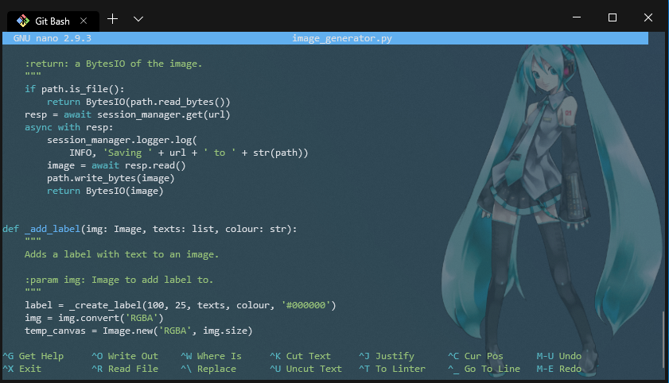
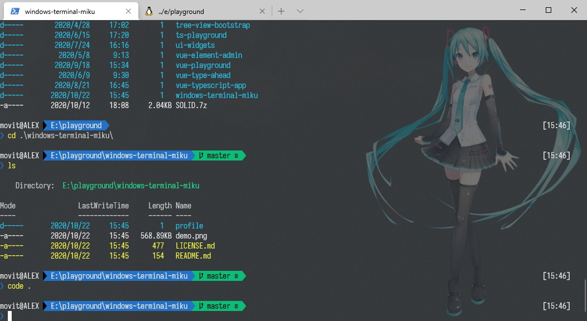
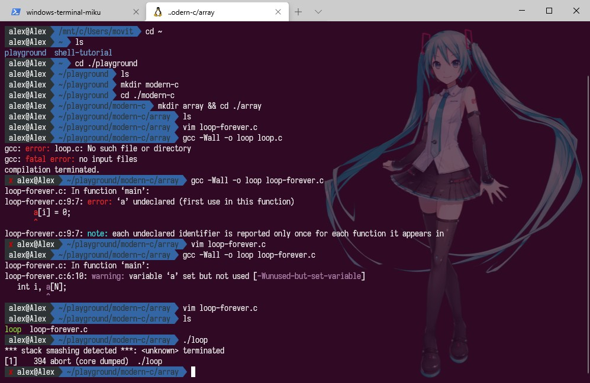

# Installation

Copy and replace the contents of the `profile` directory into the Windows 
Terminal application data folder.

If you are using the git bash profile please make sure that the profile's 
`commandLine` field is set to the correct path.

PowerShell theme (submitted by [ryanzhouff](https://github.com/ryanzhouff)):

WSL theme (submitted by [ryanzhouff](https://github.com/ryanzhouff)):

Recent changes | 2020-10-23 (Thanks [ryanzhouff](https://github.com/ryanzhouff)!):
* Replace the old-version profiles
* Add some color schemes
